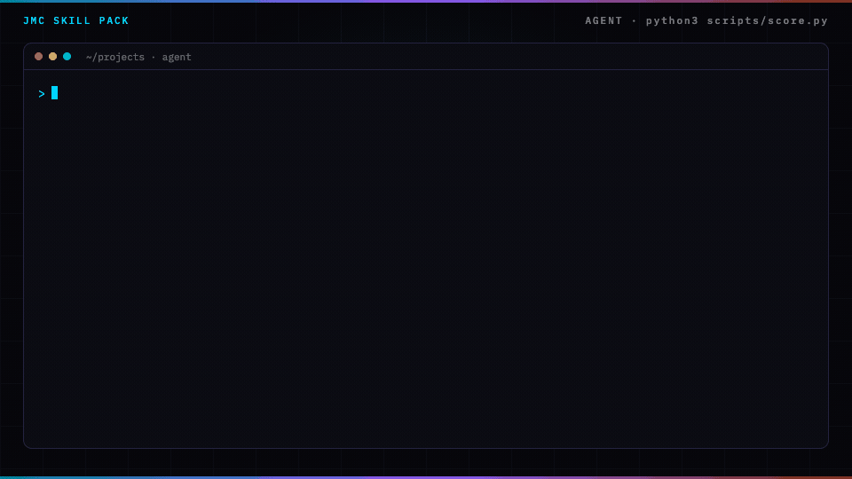

<p align="center">
  
</p>

# Landing page skill for Claude Code

A landing page is one page, one offer, and one action.

## In 60 seconds

```text
/plugin marketplace add cmj-hub/gtm-operator-skills
/plugin install landing-page@gtm-operator-skills
/landing-page:page
```

Or score the sample without an agent:

```bash
python3 scripts/score.py --file examples/page-good.json      # exit 0, prints url, offer, action, then "Next: /email-sequence:lifecycle-email"
python3 scripts/score.py --file examples/page-sitemap.json   # exit 1: - a sitemap → keep one https address; each other page gets its own draft
```

Part of the GTM operator suite — `/plugin install gtm@gtm-operator-skills` installs all ten.

Add the [gtm-operator mod](https://github.com/cmj-hub/gtm-operator-claude-mod) to see the suite's next step above your prompt and keep `brand-config.json` from being overwritten: `/plugin install gtm-operator@gtm-operator-skills`.

The sample is a one-page desk that names the week's leak.

The good draft passes. A sitemap fails the score.

<p align="center">
  
</p>

The build guide teaches a human. The pack teaches an agent.

## Install

In Claude Code, install it from the suite marketplace (the two lines above). The plugin is `landing-page`. Its one skill is `page` (in `skills/page/`), so the command is `/landing-page:page`. `/landing-page:page score` scores the draft you already have in `gtm/page.json`.

Other agents (Codex, Cursor, and the rest) can install it with the skills CLI:

```
npx skills add cmj-hub/claude-landing-page --all -g --full-depth
```

Or clone the repository and open the tree on the host you already run.

The scorer is Python in this repo. The skill calls it through `${CLAUDE_PLUGIN_ROOT}`, so it runs wherever the pack lands.

Run the tests:

```
python3 -m unittest discover -s tests
```

## What you walk out with in 15 minutes

Artifact: `examples/page-good.json`.

```
python3 scripts/score.py --file examples/page-good.json
python3 scripts/score.py --file examples/page-sitemap.json
```

```
python3 scripts/score.py --file examples/page-two-offers.json
```

The good draft exits 0 and prints the URL, the offer, and the action. The sitemap draft exits 1. The two-offer draft exits 1 and names the problem:

```
draft fails
- offer is more than one sentence → cut it to one sentence
Next: fix the lines above and run this again.
```

Then drop in yours at `gtm/page.json`. Every problem is listed at once, each with what to change, so one pass shows every fix. Add `--json` for one JSON object (`pass`, `problems`, `fixes`, `next`).

## What the score checks

- `url` is one https address with a host. A list, two addresses, or a path that says sitemap fails.
- `offer` is one sentence, 200 characters or less. A list or an `offers` key fails.
- `action` is one sentence, 160 characters or less. A list, an `actions` key, or a `ctas` key fails.
- `headline`, if present, is one sentence with no URL that shares a word with the offer. See `examples/page-headline.json`.
- `proof`, if present, is one non-empty line.

Exit 0 passes. Exit 1 fails. Exit 2 means the input is unusable.

## What this pack will not do

It will not publish the page. It does not emit a sitemap. It will not list every URL on the site.

## What belongs on a landing page?

One page, one offer, and one action. A second offer, a second action, or a list of every URL on the site fails the score.

## Does this publish the page?

No. It scores the draft. You publish it.

## On the site

- [Landing page pack](https://jaymountconsulting.com/skills/claude-landing-page) — this pack's page
- [Skill packs catalog](https://jaymountconsulting.com/skills) — install paths + every pack

## Free, no signup

[All free tools](https://jaymountconsulting.com/prototypes)

## Free, by email

[**Growth Audit**](https://jaymountconsulting.com/growth-audit) — architecture gaps in the GTM you already run. Free written report.

[**Friday Signal**](https://jaymountconsulting.com/newsletter/signal) — one Friday GTM read. No pitch in it.

## Next

Previous: [Sales offer](https://github.com/cmj-hub/claude-sales-offer)

Next: [Generative engine optimization](https://github.com/cmj-hub/claude-geo)

## Privacy and security

The scorer is local Python 3 standard library. It reads only the draft JSON you pass it; the skill reads `brand-config.json` if present and writes nothing outside your draft, `gtm/page.json`. No script opens a network connection. No telemetry, no credentials, and nothing is published. See [SECURITY.md](SECURITY.md).

## License

MIT. No paid APIs. Python 3 standard library only.
